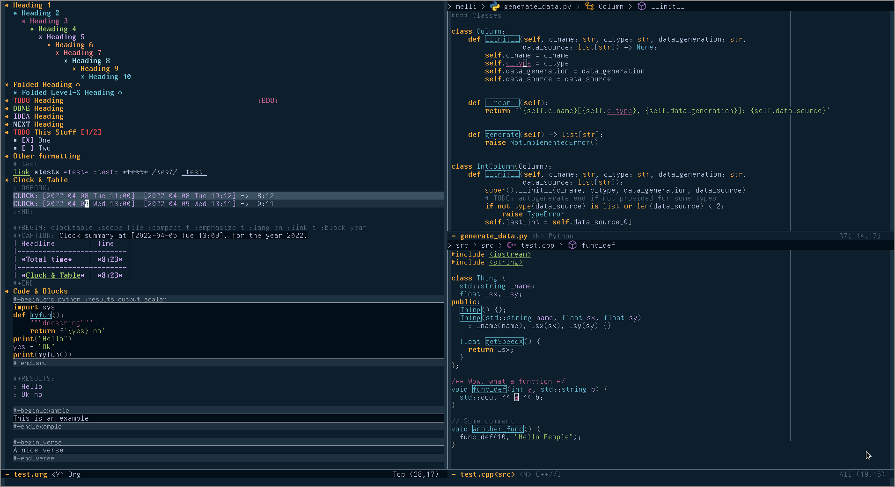
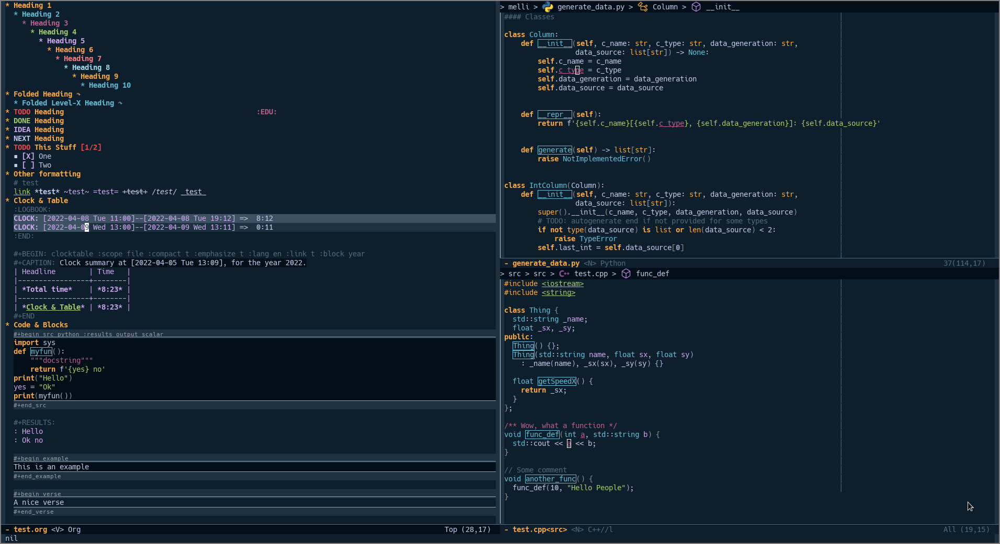
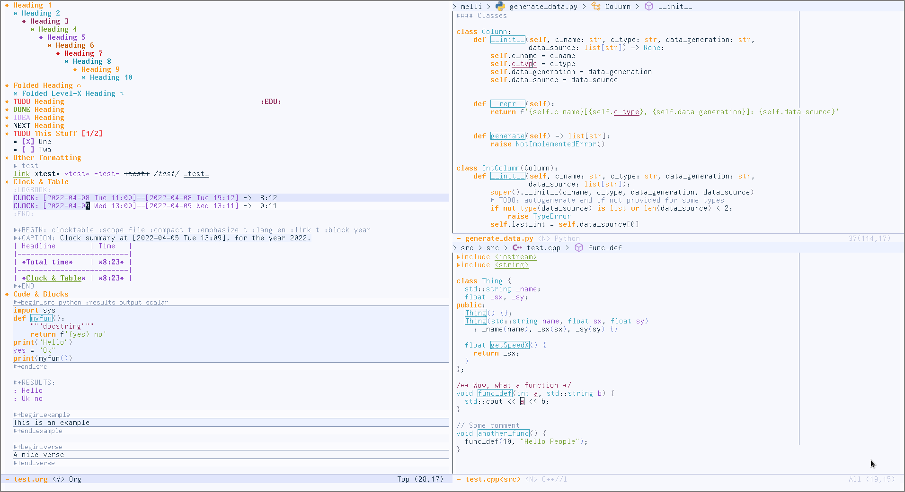

[](https://melpa.org/#/shanty-themes)

# Shanty Emacs Theme

The shanty emacs theme is meant for us, you and me - the workers - who may
not get dirty hands very often but love to code and tinker while looking at
a screen full of pleasant colors.

This theme is fairly new and still under more or less active development.
Feel free to contact me about possible enhancements (:

This theme provides a dark and also a light variant.

## Installation

The theme is now available through `package.el` (MELPA).

```emacs-lisp
;; Add this to your init.el to make packages from MELPA available through package.el
(require 'package)
(add-to-list 'package-archives '("melpa" . "https://melpa.org/packages/") t)
(package-initialize)

;; Install the theme
(package-install 'shanty-themes)
```

Or interactively via `M-x` `package-install` and then type `shanty-themes`.

If the package didn't show up try `M-x` `package-refresh-contents`.

Alternatively, one could either use straight to install the package:

```emacs-lisp
(straight-use-package '(shanty-themes :host github :repo "qhga/shanty-themes"))
```

Or by manually adding `shanty-themes.el`, `shanty-themes-dark-theme.el` and
`shanty-themes-light-theme.el` to `~/.emacs.d/themes` and the following to your `init.el`:

```emacs-lisp
(add-to-list 'custom-theme-load-path "~/.emacs.d/themes")
```

To activate the theme, one could use `M-x` `load-theme` and activate either the
dark version `shanty-themes-dark` or the light verison `shanty-themes-light`

To load the theme automatically on startup add the following code to your init.el
```emacs-lisp
;; For the dark version
(load-theme 'shanty-themes-dark t)

;; For the light version
(load-theme 'shanty-themes-light t)
```

## Screenshots

### Shanty Themes Dark




### Shanty Themes Light


